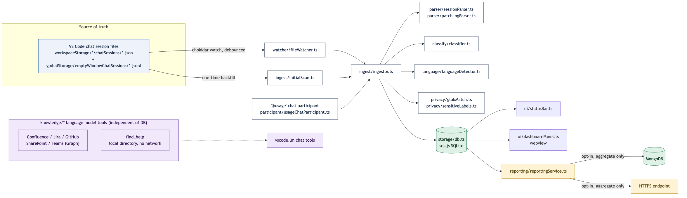
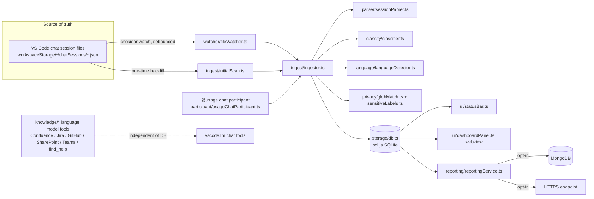

# Technical Document — Copilot Usage Logger

Version: 0.11.0
Audience: engineers maintaining or extending this extension.

## 1. Purpose

VS Code extension that locally logs, classifies, and reports on a developer's
GitHub Copilot Chat usage (requests, cost units/"credits", categories,
languages, models), with no data leaving the machine unless company-wide
reporting is explicitly enabled. It also exposes optional read-only
"knowledge grounding" chat tools (Confluence, Jira, GitHub) so Copilot chat
can cite internal documentation/issues/code.

## 2. Why this exists (design constraints)

There is no public VS Code API to observe requests sent to the built-in
`@copilot` participant — chat participants only see turns explicitly
@-mentioned to them. VS Code Copilot Chat does, however, persist full
conversation history to local JSON files under the user's VS Code profile.
This extension watches and parses those files. The on-disk format is
**undocumented and internal** and may change across VS Code versions without
notice, so every parse entry point is defensive (catches and skips malformed
entries, records `schema_version_seen` and error counts per file rather than
throwing).

Two independent capture paths exist and are deliberately deduplicated:
- **Passive**: a file watcher + parser over VS Code's own chat session files
  (primary, automatic, broad coverage).
- **Participant**: a custom `@usage` chat participant (secondary, explicit,
  fully controlled). Its own turns land in the same session files as normal
  chat, so the ingestor skips entries whose `agent.id` matches the
  extension's own participant id to avoid double-counting.

## 3. High-level architecture



<details>
<summary>Mermaid source (media/architecture-diagram.mmd)</summary>



</details>

Regenerate the PNG after editing the `.mmd` source:
```
npx @mermaid-js/mermaid-cli -i media/architecture-diagram.mmd -o media/architecture-diagram.png -b white -s 3
```

## 4. Module map (`src/`)

Grouped by subsystem — see the source tree for individual file names.

| Subsystem | Responsibility |
|---|---|
| `extension.ts` | Activation entry point: wires every subsystem below, registers commands and config-change listeners. |
| `discovery/`, `watcher/` | Locates both chat-log roots (workspace-scoped and global empty-window) and watches them with chokidar (`awaitWriteFinish` debounce). |
| `parser/` | Defensive parsers for both undocumented VS Code chat-log formats (workspace snapshot, empty-window patch-log); never throw. |
| `classify/`, `language/` | Buckets each request into a category (debug, refactor, test, docs, …) and detects its primary language. |
| `privacy/` | Path-glob exclusion and sensitive-keyword redaction — applied before anything is written. |
| `storage/` | sql.js SQLite schema/migrations, idempotent inserts, all aggregate queries. |
| `ingest/` | Ties parse → privacy filter → classify → store together; per-file cursors plus a one-time backfill scan. |
| `participant/` | `@usage` chat participant (`/stats` slash command). |
| `ui/` | Status bar item and the dashboard webview. |
| `reporting/` | Optional opt-in company-wide aggregate reporting: HTTPS/MongoDB transport, device id, multi-device credit sync. |
| `heuristics/` | Dashboard heuristics — model-fit suggestions, estimated time saved per category. |
| `export/` | CSV export of logged requests for audit. |
| `knowledge/` | Read-only language model tools: Confluence, Jira, GitHub, SharePoint/Teams (Graph), and `find_help` (fully local). |

Pure logic used by unit tests (classifier, language detector, glob matching,
model fit, time savings, and all `*Text.ts` knowledge-tool formatters) is
kept in files with no `vscode` import, since vitest cannot import the
`vscode` module. Vscode-coupled orchestration stays in adjacent files.

## 5. Storage schema (sql.js / SQLite)

```sql
CREATE TABLE requests (
  id INTEGER PRIMARY KEY AUTOINCREMENT,
  session_id TEXT, request_id TEXT,
  source TEXT CHECK(source IN ('passive','participant')),
  workspace_hash TEXT, workspace_path TEXT,
  timestamp INTEGER,               -- original request time, epoch ms
  category TEXT,                   -- free text, tunable without migration
  language TEXT,
  model_id TEXT,
  agent_id TEXT, agent_name TEXT,
  prompt_text TEXT,
  response_text TEXT,
  attachments_json TEXT,
  copilot_credits REAL,
  schema_version_seen INTEGER,
  created_at INTEGER,
  UNIQUE(session_id, request_id, source)
);
-- indexes on timestamp, category, language

CREATE TABLE ingestion_state (
  file_path TEXT PRIMARY KEY,
  last_mtime_ms INTEGER, last_size_bytes INTEGER, last_request_count INTEGER,
  last_processed_at INTEGER, schema_version_seen INTEGER,
  parse_error_count INTEGER, last_error TEXT
);
```

`UNIQUE(session_id, request_id, source)` plus per-file cursors in
`ingestion_state` make re-ingestion idempotent: only new/changed requests are
parsed on each pass. `SCHEMA_USER_VERSION` (currently 3) is applied via
`PRAGMA user_version` migrations in `storage/schema.ts`.

**Storage location**: `context.globalStorageUri`, not `context.storageUri`,
because source data spans many workspaces plus global empty-window sessions,
and `context.storageUri` is `undefined` with no folder open. sql.js is
in-memory-first WASM SQLite — the DB is `export()`ed to bytes and written to
disk on a debounced idle timer and in `deactivate()`; rows written between
flushes can be lost on a crash (accepted trade-off, no WAL).

## 6. Data flow (single request, passive path)

1. User sends a Copilot Chat message → VS Code writes/updates a
   `chatSessions/<id>.json` file.
2. chokidar (debounced via `awaitWriteFinish`) fires a change event.
3. `ingestor.ts` re-parses the file via `sessionParser.ts`, using the file's
   `ingestion_state` cursor to only look at new/changed requests.
4. Each new request is checked against `usageLogger.excludedPathGlobs`
   (dropped entirely if matched) and against the extension's own
   participant `agent.id` (dropped if it's `@usage`'s own turn, since that's
   captured directly via the participant path with `source='participant'`).
5. Remaining requests are classified (`classify/classifier.ts`), language
   is detected (`language/languageDetector.ts`), and the row is upserted into
   `requests` (idempotent on the `UNIQUE` constraint).
6. `statusBar.ts` and any open `dashboardPanel.ts` are refreshed.
7. If `usageLogger.enableCompanyWideReporting` is on, `reportingService.ts`
   periodically ships aggregate payloads to the configured HTTPS endpoint or
   MongoDB collection.

## 7. Status bar

`ui/statusBar.ts` shows, per `usageLogger.statusBarDisplay`:
- `"requests"` (default): today's request count, `$(copilot) {n} today`.
- `"remainingCredits"`: remaining cost-unit budget for today, computed from
  `dailyBudgetInfo()` (monthly limit minus credits used before today, divided
  by remaining days in the month, minus today's own spend). Falls back to the
  request-count display if `usageLogger.monthlyCreditLimit` isn't set (budget
  is `null`).
- Private mode (`usageLogger.privateMode`): lock icon, logging paused.
- Amber background/`$(warning)` icon once today's spend meets/exceeds
  today's even daily-budget share, in either display mode.

The setting is read live in `refresh()` (no cached field), and
`extension.ts`'s `onDidChangeConfiguration` listener calls `statusBar.refresh()`
on change so toggling it takes effect immediately, no reload required.

## 8. Dashboard webview

`ui/dashboardPanel.ts` hosts a `WebviewPanel` with inline HTML/CSS/JS (no
charting library — hand-built SVG). `postData()` sends: counts by
category/language/model/day, `creditsByModel()`, `creditsByDay()`,
`projectedMonthEnd` (burn-rate forecast: `(creditsThisMonth / dayOfMonth) *
daysInMonth`, compared against `monthlyCreditLimit`), model-fit and
time-savings heuristics, and multi-device credit sync state. A parallel
`companyDashboardPanel.ts` renders aggregate data reported by other devices
when company-wide reporting is enabled.

## 9. Knowledge tools (Confluence / Jira / GitHub / Graph / Find-help)

Independent of the usage-tracking DB. Each is a read-only
`vscode.lm.registerTool` implementation registered via
`contributes.languageModelTools` (requires `engines.vscode >= 1.95` for the
finalized contribution point):

| Tool | Source | Auth |
|---|---|---|
| `search_confluence`, `get_confluence_page` | Confluence Cloud REST API | Atlassian email + API token (Basic auth) |
| `search_jira`, `get_jira_issue` | Jira Cloud REST API | Same Atlassian email + API token as Confluence |
| `search_github` | GitHub REST/code search API | Personal access token, `Authorization: Bearer`, optionally scoped by `usageLogger.githubOrg` |
| `search_sharepoint`, `search_teams` | Microsoft Graph `/search/query` (`entityTypes: ["driveItem"]` / `["chatMessage"]`) | Microsoft Graph access token (delegated), `Authorization: Bearer` — short-lived (~1h), no refresh flow; user re-runs the set-token command periodically |
| `find_help` | Local JSON "blocker directory" (inline setting, a file path, or a bundled sample) | None — no network, no credentials |

Security posture (applies to all three): HTTPS-only (`httpJson.ts` refuses
`http://`), 5MB response cap, 10s default timeout, tokens stored in
`context.secrets` (never in settings.json, never logged), read-only
operations only, and results are bounded by the underlying service's own
permissions (no privilege escalation). The SharePoint/Teams tools share a
single Graph token the same way Confluence/Jira share one Atlassian token,
via the shared `httpPostJson` helper (Graph search is POST, not GET).

`find_help` is the exception to the network posture: it makes **no** outbound
calls at all. It matches the free-text blocker against a local directory
(`blockerText.ts`, pure/unit-tested scoring), loaded by `blockerRoutes.ts`
from `usageLogger.blockerDirectory` (inline), then
`usageLogger.blockerDirectoryPath` (a JSON file, absolute or workspace-relative
so a team can commit it), falling back to the bundled
`media/blocker-directory.sample.json`. `parseBlockerDirectory` drops any link
whose scheme isn't in an allowlist (`https`/`http`/`msteams`/`mailto`), so a
malicious directory can't smuggle a `javascript:`/`file:` link into a rendered
suggestion.

## 10. Configuration surface (`contributes.configuration`)

Key settings (see `package.json` for authoritative list/defaults):
`enablePassiveCapture`, `retentionDays`, `privateMode`, `excludedPathGlobs`,
`sensitiveLabelKeywords`, `monthlyCreditLimit`, `statusBarDisplay`,
`timeSavingsMinutesPerCategory`, `enableCompanyWideReporting`,
`reportingEndpointUrl`, `reportingIntervalMinutes`, `reportingTransport`,
`allowInsecureHttp`, `mongoDatabase`, `mongoCollection`,
`confluenceBaseUrl`, `confluenceEmail`, `atlassianEmail`, `jiraBaseUrl`,
`githubOrg`, `blockerDirectoryPath`, `blockerDirectory`.

Commands (Command Palette, prefix `Copilot Usage:`): Open Dashboard, Open
Company-Wide Dashboard, Rescan Chat History, Purge All Logged Data, Send
Company-Wide Report Now, Set/Clear Reporting API Key, Set/Clear MongoDB
Connection String, Toggle Private Mode, Export Audit CSV, Sync Actual
Credits Used This Month, Set/Clear Confluence API Token, Test Confluence
Connection, Test Jira Connection, Set/Clear GitHub Token, Open Help
Directory, Setup (guided walkthrough entry point).

## 11. Security posture (OWASP-relevant)

- **No secrets in settings.json**: API tokens (Confluence/Jira, GitHub, Mongo
  connection string, reporting API key) live in `context.secrets`
  (VS Code SecretStorage), not workspace/user settings.
- **Transport security**: all outbound HTTP in `knowledge/httpJson.ts` and
  `reporting/reporter.ts` requires HTTPS by default; plaintext HTTP requires
  explicitly opting in via `usageLogger.allowInsecureHttp` (intended for
  local/dev endpoints only).
- **Bounded I/O**: knowledge-tool responses are capped at 5MB and a 10s
  timeout to avoid unbounded memory/hangs from a compromised or slow
  upstream.
- **Least privilege**: all knowledge tools are read-only and respect the
  underlying service's existing permissions — no writes, no privilege
  escalation.
- **Local-first data**: full prompt/response text is stored unencrypted
  under `context.globalStorageUri`; this is called out prominently in
  `README.md`. Mitigations available to the user: `retentionDays`,
  `purgeData` command, `privateMode`, `excludedPathGlobs`.
- **Idempotent ingestion**: `UNIQUE(session_id, request_id, source)` plus
  per-file cursors prevent duplicate/replayed rows from a re-triggered
  watcher event.
- **Defensive parsing**: the chat session file format is undocumented and
  can change; parsers catch and skip malformed entries per-request rather
  than throwing, and track `schema_version_seen`/error counts for
  diagnosis.

## 12. Build, test, and release

- Type-check: `npx tsc --noEmit`
- Unit tests: `npx vitest run` (currently 65 tests across 9 files; only
  vscode-free modules are covered, per the module-split convention above)
- Lint: `npx eslint src`
- Dev bundle: `node esbuild.js`; production bundle: `node esbuild.js --production`
  (esbuild marks `vscode` and `fsevents` external; a custom plugin copies
  `node_modules/sql.js/dist/sql-wasm.wasm` → `dist/sql-wasm.wasm`, required
  for sql.js WASM init at runtime and must land in the `.vsix`)
- Package: `rm -f *.vsix && npx @vscode/vsce package --no-dependencies --allow-star-activation`
- Local install: `"/Applications/Visual Studio Code - Insiders.app/Contents/Resources/app/bin/code" --install-extension <vsix> --force`,
  then remove the previous version's extension directory under
  `~/.vscode-insiders/extensions/`
- Release: commit → `git tag vX.Y.Z` → push branch and tag → GitHub Actions
  "CI" and "Release" workflows build/test and attach the `.vsix` to a GitHub
  Release.

## 13. Known limitations / deferred scope

- No public VS Code/GitHub API exposes org-level Copilot premium-request
  quota to third-party extensions; only per-request `copilotCredits` is
  available locally, so cross-device totals rely on the manual
  `creditsSync.ts` reconciliation flow rather than a live API.
- Remote windows (SSH/WSL/Codespaces): `context.globalStorageUri` resolves
  remote-side and may not reflect local chat activity; not a primary target.
- Chat session file format is internal/undocumented and may change across
  VS Code versions without notice.
