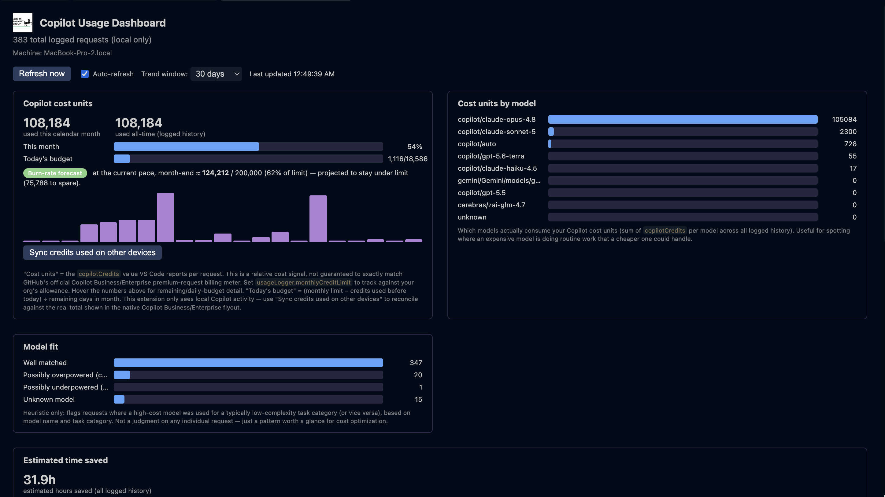
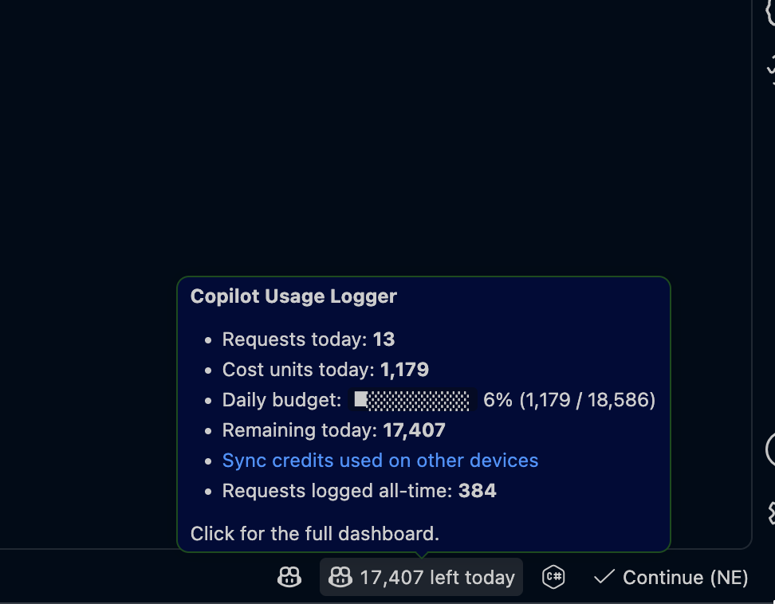

<!-- _class: title -->

# Copilot with Institutional Knowledge

Turning GitHub Copilot from a generic coding assistant into one that knows how Lloyds actually works — and proving it's paying off.

---

## 🧱 The problem

The biggest blocker for developers isn't writing code — it's **understanding the platform**.

- Lloyds' internal platform and GCP environment are large, layered, and constantly evolving.
- The only real source of truth is scattered across **Confluence pages and peer/Slack discussions** — slow to search, easy to miss, hard to keep current.
- **New joiners** feel this hardest: getting environment access, finding the right runbook, and knowing who to ask can take days to weeks before they write a useful line of code.
- Meanwhile, we have **no visibility** into whether Copilot is actually helping, where it's helping most, or what it's costing us.

---

## 💡 The opportunity

Give Copilot the same institutional knowledge a senior engineer already carries in their head.

- Inspired by Atlassian **Rovo**'s approach of grounding AI assistants in a company's own knowledge, not just public training data.
- Make Copilot **Lloyds-aware**: able to cite our own wiki, tickets, code, and team conversations when it answers.
- Track usage **across the company** — who's using it, for what kind of work, and where it's actually saving time.
- A guided **"find help" skill** that, for any non-code blocker — access, permissions, a broken environment, a tooling or process question — names **who to contact, which Teams chat, which page, or which ServiceNow item** to raise, instead of a 20-minute Confluence hunt or a wrong-channel ask.

---

## 📊 What we've built: usage & cost visibility

A local-first VS Code extension that turns raw Copilot activity into answers leadership actually asks for.

- **Dashboard**: requests by category (debug, refactor, test, docs, …), by language, by model, by day.
- **Real cost tracking**: per-request Copilot cost units, monthly burn-rate forecast against a configurable budget, daily spend pacing.
- **Model-fit heuristic**: flags when an expensive model is used for routine work (or a lightweight one for something that needed more) — a cost-optimization signal, not a judgment call.
- **Estimated time saved**: directional estimate per category, so the value story isn't just a vibe.
- **Local by default**: full detail never leaves the machine; company-wide reporting is opt-in and aggregate-only.

---

## 🧠 What we've built: institutional knowledge, in chat

Six read-only tools let Copilot chat ground its answers in Lloyds' own systems — no more guessing:

| Tool | Grounds answers in |
|---|---|
| 📘 `#confluence` / `#confluencePage` | Runbooks, architecture, onboarding, standards |
| 🎫 `#jira` / `#jiraIssue` | Tickets, acceptance criteria, work status |
| 🐙 `#github` | Org-wide issues, PRs, code, repositories |
| 📁 `#sharepoint` | Internal documents beyond the wiki |
| 💬 `#teams` | Team decisions and discussions |
| 🆘 `#findHelp` | Who to contact / Teams / page / ServiceNow for any **non-code** blocker |

All **read-only** and **permission-aware**. The knowledge searches are **HTTPS-only** with credentials in **OS secret storage** (never `settings.json`); `#findHelp` is **fully local** — a curated directory the org owns, no network, no credentials.

---

## 🛡️ What we've built: governance & company-wide insight

The features that make this safe to roll out at Lloyds scale — not just a personal toy.

- **Company-wide study (opt-in)**: periodically ships an **aggregate-only** report — counts by category, language, model, and day. **Never** prompt or response text. This is how leadership sees adoption and ROI across teams without ever reading anyone's code.
- **Private mode**: one toggle pauses all logging instantly. Sensitive spike of work stays completely unrecorded — nothing written to the local store at all.
- **Redaction & exclusion**: path globs skip flagged files entirely; sensitive-label keywords redact prompt/response text while keeping the metadata. Configurable **retention** auto-expires old data.
- **Local-first**: full detail never leaves the machine unless company-wide reporting is deliberately switched on — and even then, only aggregates go.

---

## ⚙️ How it works

One watcher, one local database, two independent capture paths — the knowledge tools (including `#findHelp`) sit alongside it, never touching the usage data.

---

## 🔄 How data is pulled — component by component

Every source is **pulled on demand**, never pushed or synced in bulk.

| Component | Trigger | Pulled from | Where it lands |
|---|---|---|---|
| 📘🎫🐙📁💬 Knowledge tools | Chat question needs grounding | Live **HTTPS API**, read-only, one query | Answer only, **nothing stored** |
| 🆘 `#findHelp` | Non-code blocker question | Local JSON directory on disk | Answer only, **zero network** |
| 🖥️ Usage logger | Chat activity happens locally | `chokidar` watches local chat-session log files | Parsed → **local** SQLite → dashboard reads it directly |
| 📡 Company-wide report *(opt-in)* | Scheduled interval, if enabled | Local SQLite, aggregated | **Counts only** to the internal endpoint — never prompt/response text |

Same shape everywhere: **OS secret storage, HTTPS-only, read-only, pull-not-push** — the only thing that ever leaves the machine is an opt-in, aggregate-only count.

---

## 🖥️ See it in action

Live dashboard (left) and status bar hover (right) — real usage, real cost units, real forecast, on a real developer's machine today.

---

## ✅ Why it matters

- **Faster unblocking**: whether it's a code question or "who owns GCP access?", developers get pointed at the right page, ticket, or contact in seconds, not days.
- **Cost governance**: real spend visibility and a burn-rate forecast, so premium-request budgets don't surprise anyone at renewal.
- **Safe by design**: local-first storage, opt-in aggregate-only company-wide reporting, private mode, read-only knowledge tools, path exclusion, sensitive redaction, and configurable retention.
- **A foundation, not a one-off**: the same pattern (shared HTTPS/auth helpers, one token per platform, one local directory) extends cleanly to whatever we plug in next.

---

## 🗺️ Roadmap & the ask

**Next up:**
- Extend grounding to ServiceNow and Azure DevOps where teams use them instead of Jira/GitHub.
- Curate the `#findHelp` directory with real Lloyds owners/links and grow it as new blockers surface.
- Company-wide adoption dashboard once reporting is rolled out beyond a pilot.

**The ask:**
- A pilot team willing to run it for a sprint and give feedback.
- Sponsorship for an internal reporting endpoint so usage/cost data can be aggregated safely, company-wide.

---

<!-- _class: title -->

# Thank you
